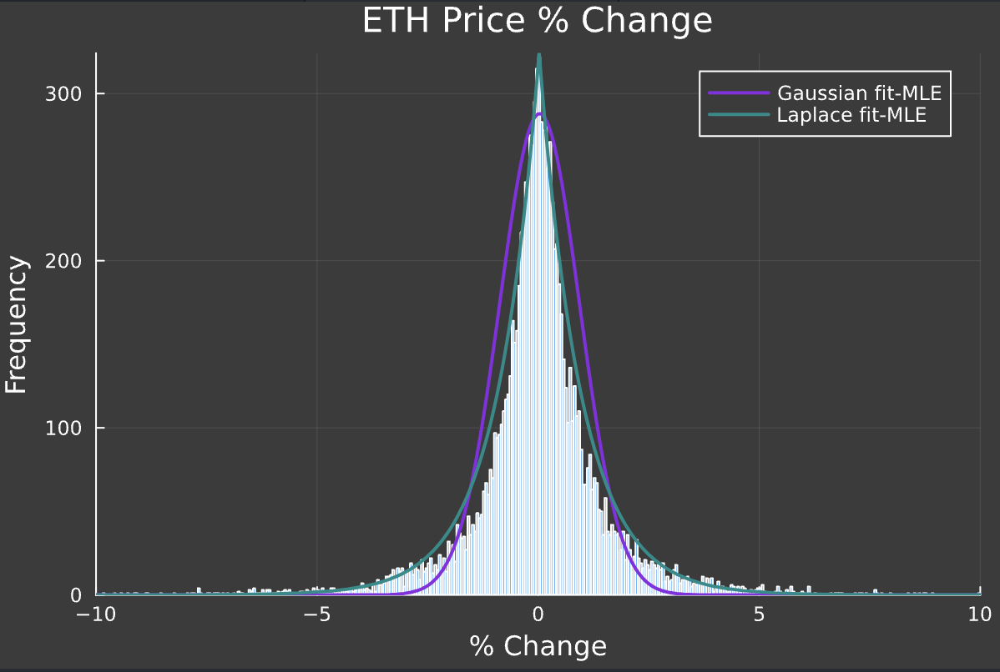
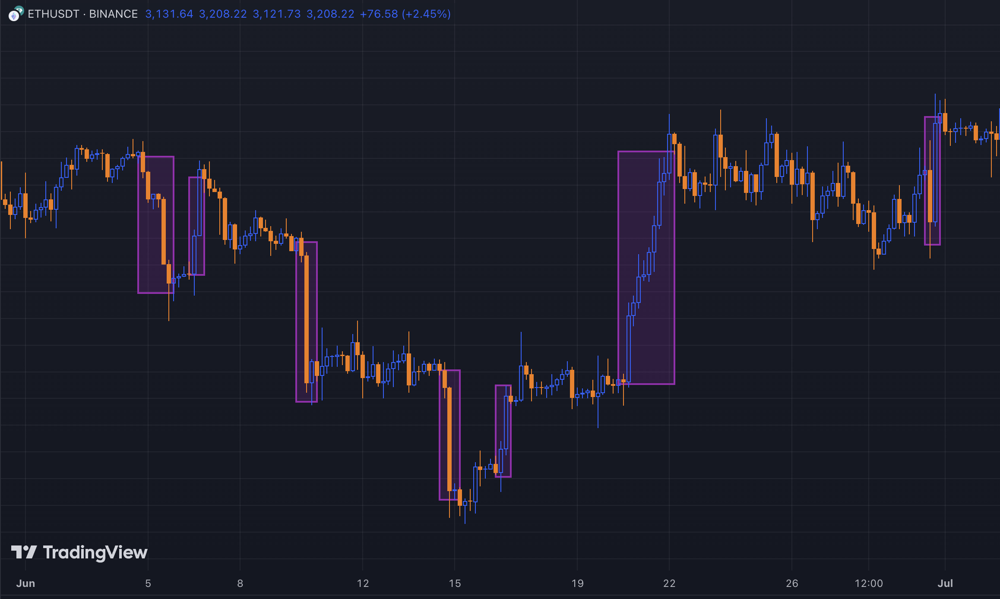
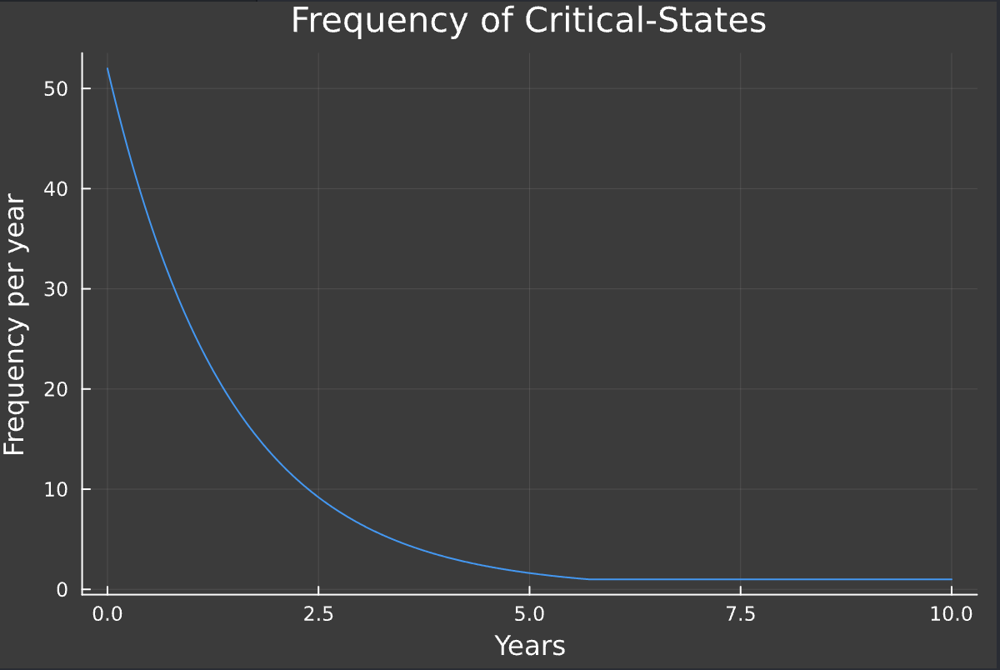
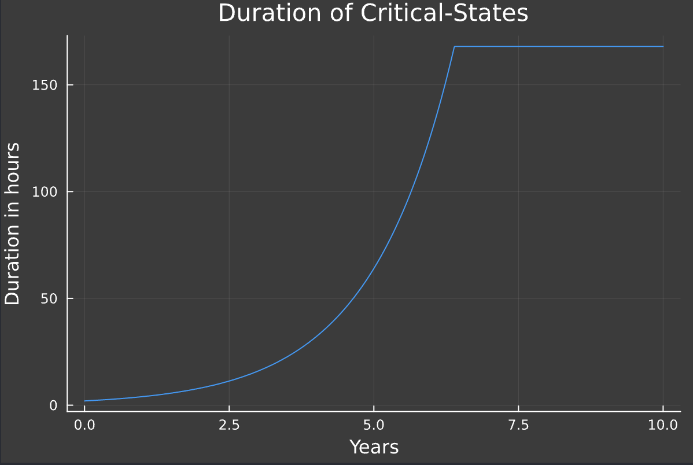
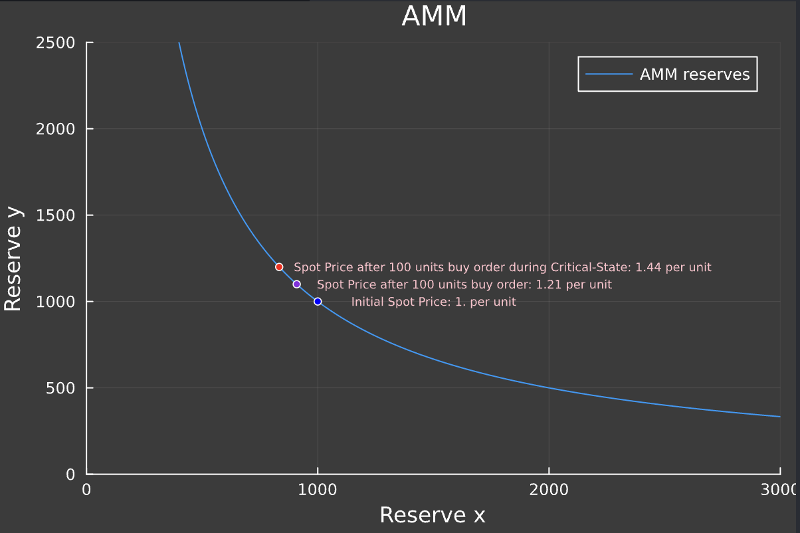

<div align="center">

# [ RedRose 🌹 ]

[](https://twitter.com/redrose)
[](https://redrose.com/)


[](http://unlicense.org/)

---

## Money that goes up


[Discord](https://discord.gg/redrose) • [twitter](https://twitter.com/redrose) • [Website](https://redrose.com/)

</div>

---

- [Introduction](#introduction)
- [The ROSE Market Strategist](#the-rose-market-strategist)
- [Example](#example)
- [Foundry](#foundry)

## Introduction

Price fluctuations over a fixed interval exibhit unique characteristics common to [earthquakes magnitudes](https://www.nature.com/articles/s41598-019-46864-8), US wealth distribution and the [number of direct connection between twitter users](https://ieeexplore.ieee.org/document/6785885): Their distribution have long tails caused by the frequency of disproportionate events.


<div style="display: flex; flex-direction: row; justify-content: space-between; gap: 10px;">
  
</div>

<!-- <style>
  img:hover {
    transform: scale(1.05);
  }
</style> -->

Price action can be decomposed and treated as a combination of two main states:

- a trending state and
- a high-volatility state

The transition between these two states is called critical-points. Numerous tradfi quant strategies rely on finding these critical points to switch strategies.

<div style="display: flex; flex-direction: row; justify-content: space-between; gap: 10px;">
  
</div>

We refer to the high-volatility states as critical-states and propose a system that predictably leverages these events to push ROSE price upwards.

## The ROSE Market Strategist

The [_ROSE_](https://dexscreener.com/solana/1nc1nerator11111111111111111111111111111111) system is a `ERC20Permit` token coupled with a dynamic market-making strategy (called Market Strategist or MS) driving volume and behavior at fixed intervals called critical states.
During these periodic events, the MS will skew incentives to the upside by imposing a slashing mechanisms on sell orders and rewards for buyers, while reducing the amount of liquidity available to increase price volatility.

Critical-states will initially be triggered every week, and will last for two hours. the frequency of these events will progressively decrease, while the duration increases. The epoch length and critical-state duration will approximately double every year, until capping at once every year, for one week.  
(e.g. two years from deployement, critical-states will be triggered every ~month and will last 8 hours. four years from deployement, it will happen every ~4 months for 32h).

<div style="display: flex; flex-direction: row; justify-content: space-between; gap: 10px;">
  
  
</div>

At the end of the critical-state, liquidity will be reinserted into the market, then a burn will occur.  
The MS will provide liquidity following the new reserves ratio. Then if the spot price increased, the excess ROSE will be burned. If the spot price decreased, the excess ETH will be maket sold for ROSE then burned.

We instantiate money with the following properties:

- periodic controlled critical-states with
  - liquidity removing to increase price volatility
  - incentive layer to skew price action to the upside
- a burning mechanism that
  - creates a net deflationary asset
  - support price by doing buybacks if the asset loses value
- PUNK
  - open-source, without license
  - automated, permissionless, censorship-resistant

🌹

## Example

let's illustrate how the system works with an example.

We start with a market composed of two reserves X, Y where X is the ROSE reserve and Y is the ETH reserve. for simplicity, we'll set:

    X : 1000.
    Y : 1000.

Giving a ROSE spot price of:

    price : Y / X = 1.

Assuming constant product for the market and ignoring swap fees, a swap of 10 ETH for ROSE would result in the following changes:

    X : K / Y = (1000. * 1000.) / (1000. + 10.) ≈ 990.
    Y : 1000. + 10.

and an approximate ROSE spot price of:

    price : Y / X ≈ 1.02 ETH

In this contrived example, the market is symmetric and the spot price of ETH after a swap of 10 ROSE for ETH would also be 1.02 ROSE.

At the start of the critical-state, the market strategy will record the reserves R⁺ₜ and withdrawn liquidity from the strategy portfolio ω⁺ₜ then reduce it's liquidity position by 50%, resulting in:

    R⁺ₜ : (500., 500.)
    ω⁺ₜ : (500., 500.)
    priceₜ : Y / X = 1.

during this period, a swap of 10 ROSE for ETH would result in the following changes:

    X : K / (Y + in) = (500. * 500.) / (500. + 10.) ≈ 490.2
    Y : 500. + 10. = 510.
    R⁺ₜ₊₁ : (490.2, 510.)

And a new spot price of:

    priceₜ₊₁ : Y / X ≈ 1.04

<div style="display: flex; flex-direction: row; justify-content: space-between; gap: 10px;">
  
</div>

We observe that in this closed system, the volatility is directly correlated to the available liquidity. But as is, the volatility can go both ways, and we need an incentive mechanism in order to lower the potential sell impact on the market. The slashing mechanism will cut a fee (initially set to 25%) from the sold ROSE during the critical-state. The fees will then be distributed to buyers from this epoch's critical-state, proportional to the amount of ROSE bought.

At the end of the critical-state, we record the reserves R⁺ₜ₊₁ and the new spot price, let's say:

    R⁺ₜ₊₁ : (400., 625.)
    priceₜ₊₁ : Y / X = 1.5625

and compute the difference of reserves, using the new price ratio:

    ΔR⁺ₜ₊₁ : R⁺ₜ₊₁ - R⁺ₜ = (400-500, 625-500) = (-100., 125.)

The strategy will then provide back 500 ETH and 500 * (1 / 1.5625) = 320 ROSE, resulting in new reserves:

    R⁺ₜ₊₂ : (720., 1125.)
    ω⁺ₜ₊₂ : (180., 0.)

The excess 180 ROSE is then burned over a 12-hour period, resulting in a reduction of the ROSE supply.

In another scenario, volume sold outweighs volume bought, and at the end of the critical state, we have:

    R⁺ₜ₊₁ : (625., 400.)
    priceₜ₊₁ : 0.64

The strategy adds the 500 ROSE, and (500 * 0.64) = 320 ETH into the liquidity pool, resulting in:

    R⁺ₜ₊₂ : (1125., 720.)
    ω⁺ₜ₊₂ : (0., 180.)

<!-- The strategy then proceeds to sell half of the excess ETH for ROSE over a 12-hour period. Assuming no other swaps, we have:

    R⁺ₜ₊₃ : (1000., 810.)
    ω⁺ₜ₊₃ : (115., 90.)
    priceₜ₊₃ : 0.81

Finally, the strategy will add back the 115 ROSE and 90 ETH to the reserves, resulting in:

    R⁺ₜ₊₄ : (1115., 900.)
    ω⁺ₜ₊₄ : (0., 0.)
    priceₜ₊₄ : 0.782 -->

The strategy then proceeds to sell the excess ETH for ROSE. Assuming no other swaps, we have:

    R⁺ₜ₊₃ : (900., 990.)
    ω⁺ₜ₊₃ : (225., 0.)
    priceₜ₊₃ : 1.

These mechanisms are introduced as ways to support the price of the ROSE asset and maximize upward price movement over time.

## Foundry

### Install

```shell
$ curl -L https://foundry.paradigm.xyz | bash

$ foundryup
```
### install dependencies

```shell
$ forge install .
```

### Build

```shell
$ forge build
```

### Test

```shell
$ forge test
```


### Gas Snapshots

```shell
$ forge snapshot
```

### Deploy

```shell
$ forge script script/<ScriptName>.s.sol:<ScriptName> --rpc-url <your_rpc_url> --private-key <your_private_key>
```
