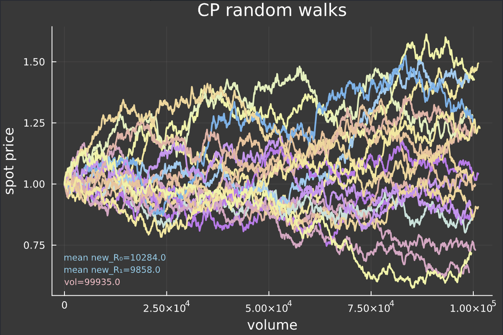
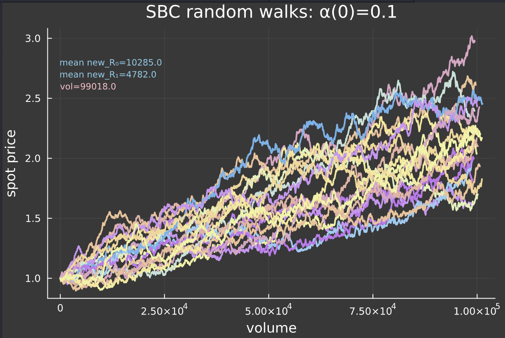

<div align="center">

# [ **Rose** ]

[](https://twitter.com/redrose)
[](https://redrose.com/)


[](http://unlicense.org/)


[Discord](https://discord.gg/redrose) • [twitter](https://twitter.com/redrose) • [Website](https://redrose.com/)

</div>

---

- [Introduction - The Bloom](#introduction---the-bloom)
- [Definition - The Garden](#definition---the-garden)
  - [The Asymmetric AMM](#the-asymmetric-amm)
  - [Burns and buybacks](#burns-and-buybacks)
  - [ROSE DAO](#rose-dao)
- [Deep Dive - The Roots](#deep-dive---the-roots)
  - [CPMM bonding curve](#cpmm-bonding-curve)
  - [ROSE Asymmetric Bonding Curve](#rose-asymmetric-bonding-curve)
  - [Asymmetric AMM : Continuous model](#asymmetric-amm--continuous-model)
  - [aAMM Differential Equations](#aamm-differential-equations)
<!-- - [Usage](#usage)
  - [App](#app)
  - [Contracts](#contracts) -->

---

## Introduction - The Bloom

*23/07/2024*

**A New Era**

```md
Here lies a manifesto for freedom,  

A Rose, blossoms in the sky.

🌹
```

## Definition - The Garden

**Rose** is the greatest on-chain money experiment.  

### the Asymmetric AMM

**Rose** implements a custom JIT liquidity strategy that optimizes for *price upside volatility* and *deep liquidity* on exits, **mimicking an [Asymmetric AMM](models/ContinuousModel.jl)**.

An Asymmetric AMM ($aAMM$) is a Bonding Curve with two distinct formulas for buy and sell orders.  
[Rose aAMM market implementation](contracts/src/Rose.sol) decreases liquidity on buy orders to increase upside volatility, while providing deep liquidity for sellers. As a result, for an equivalent long/short volume, the price will increase *proportionally to the volume itself*.  
**This is unlike traditional AMM bonding curves where a long/short ratio of 1 implies no price changes***  
*ignoring plateform fees

For every buy order, a skew parameter $α$ determines the quantity of the reserves to withdraw.  
A penalty is added on sell orders to incentivize long-term holding, dictated by the slash-factor $ϕ$.  

<div style="display: flex; flex-direction: row; justify-content: space-between; gap: 10px;">
  
</div>

*Constant-product random walk. initial reserves: (1e4, 1e4). The random walk is generated from a series of buy and sell orders drawn from a Laplace distribution with parameters (μ=0, θ=10).*

<div style="display: flex; flex-direction: row; justify-content: space-between; gap: 10px;">
  
</div>

*Asymmetric AMM random walk. initial reserves: (1e4, 1e4) and initial α: 0.1. Laplace parameters (μ=0, θ=10).*

In practice, the parameter $α$ is dynamically adjusted using the remaining reserves to ensure it reaches an optimal spot in the tradeoff between upside volatility, slippage and total available liquidity.

From the constant-product formula, there is a proportional relation between the reserves liquidity and volatility for a fixed amount bought.

Rose controls volatility by reducing market depth on buy orders, while preserving deep liquidity on sell orders.

<!-- The soundness of the system stems from the fact that one can view the rose $aAMM$ as a Just-In-Time liquidity strategy on an AMM pool, JIT withdrawing part of the liquidity on buy orders, then providing back at the updated reserve ratio. -->

The soundness proof of this system is based on the fact that it can be modeled within the AMM model, with a ROSE/ETH pool with the buy case:

- a lp token `burn` of $α$
- a `swap` of $x$ from $token_0$ to $token_1$
- a `mint` at the new reserves ratio

and the sell case:

- a `swap` (exact output) of $x$ from $token_1$ to $token_0$ with a sell fee on $token_0$

From this we can compute and derive price of `Rose` is a direct function of the market liquidity.

### Burns and buybacks

Since a buy order is not executed on full liquidity, the reserves ratio increases faster than a classical AMM pool, thus leaving an excess of `rose` when reinjecting liquidity.  
This excess amount is removed from the reserves then burned, creating a net deflationary asset, without traditional deflation shortcomings:

*Rose's aAMM binds the asset deflation to market liquidity.*

In theory, when the monetary mass of an asset decreases, price automatically increases because the total value is still identical, distributed over less supply.  
In practice, a burn doesn't directly affect market liquidity and often does not meaningfully implies price appreciation.

A penalty on sells is added to increase the LP portfolio in the denominating asset, and is used to proceed to strategic buybacks to further support `Rose` price.

### ROSE DAO

ROSE protocol is decentralized from day one.

Every parameter change is automated, every action taken with the treasury is the result of decentralized coordination between community members.

This set-up makes the protocol practically resilient to any form of government coersion and censorship, while setting free from the chains of legacy entities.

We don't respect the CORP,

Rose is *new-money*, Rose is *PUNK money*.

## Deep Dive - The Roots

### CPMM bonding curve

We start by defining a pair of reserves $(R_0, R_1) : ℝ²$, and the Constant-product Transition Function:

$$
(R_0 + x) \cdot (R_1 - y) = K
$$

solving for y:

$$
y = R_1 - \frac{K}{R_0 + x}
$$

where:

- $K$ : the constant product $R_0 ⋅ R_1$  
- $x$ : amount of $token_0$ in/out, defined from $-R_0$ to $+∞$  
- $y$ : amount of $token_1$ out/in, defined from $-∞$ to $+∞$

From this, we derive the Constant-Product Bonding Curve $Γ : (R_0, R_1, x) -> (R_0′, R_1′, y)$:

- $R_0′ = R_0 + x$

- $R_1′ = \frac{K}{R_0 + x}$

- $y = R_1′ - R_1$

With a spot price is defined as:
$p = \frac{R_1}{R_0}$

> [!NOTE]
> All swaps are expressed in terms of $token_0$. A positive $x$ means a buy order of $y$ $token_1$ against $x$ units of $token_0$, while a negative $x$ represent a sell order of $y$ $token_1$ against $-x$ $token_0$.  

### ROSE Asymmetric Bonding Curve

In order to sustain price performance, we introduce the Skew Trading Function:

$$
y = \begin{cases}
R_1 - \frac{α^2K}{α R_0 + x} & \text{for } x > 0 \\
(\frac{K}{R_0 + x} - R_1) \cdot ϕ & \text{for } x < 0
\end{cases}
$$

Here,  

- $α$ is the skew parameter
- $ϕ$ is the slash parameter

We then define the Asymmetric AMM  $aAMM : (α, R_0, R_1, x) -> (R_0′, R_1′, y)$:

$$
R_0′, R_1′, y = \begin{cases}
Γ^+(R_0, R_1, x) & \text{for } x > 0 \\
Γ^-(R_0, R_1, x) & \text{for } x < 0
\end{cases}
$$

with $Γ^+ : (R_0, R_1, x) -> (R_0′, R_1′, y)$ defined as:

- $R_0′ = R_0 + x$

- $R_1′ = \frac{αR_1}{αR_0} ⋅ R_0′$

- $y = R_1 - \frac{α^2K}{αR_0 + x}$

and $Γ^- : (R_0, R_1, x) -> (R_0′, R_1′, y)$ defined as:

- $R_0′ = R_0 - x$

- $R_1′ = \frac{K}{R_0′}$

- $y = (R_1′ - R_1) \cdot ϕ$

This asymmetry ensures that selling pressure reduces the reserve ratio more gradually compared to buying pressure.

### Asymmetric AMM : Continuous model

We then extend the discrete model to continuous time.

Let $ϕ(t)$ be the continuous slash-factor function $(0 \leq ϕ(t) \leq 1)$.

Let $x(t)$, the rate of buying (if positive) or selling (if negative)

Let the spot price $p$ be:

$$p = \frac{R_1(t)}{R_0(t)}$$

Let $α(t)$ be the continuous skew function defined for $(0 \leq α(t) < 1)$:

$$α(t) = 1 - (α(0) * \frac{R_1(t)}{R_1(0)})$$

As volume increases over time, $R_1$, the reserves of $token_1$ decreases,meaning that the ratio of reserves removed on buy orders will decrease over time.

we can now define the continuous Asymmetric AMM : $(α(t), R_0(t), R_1(t), x(t)) -> (R_0′(t), R_1′(t), y(t))$

By definition,

$$\frac{dR_0}{dt} = x(t)$$

Then,

$$
R_1(t) = \begin{cases}
\frac{α(t)R_1(t)}{α(t)R_0(t)} ⋅ (R_0(t) + x(t)) & \text{for } x(t) > 0 \\
\frac{K}{R_1(t) + x(t)} & \text{for } x(t) < 0
\end{cases}
$$

and

$$
y(t) = \begin{cases}
R_1(t) - \frac{α(t)^2K}{α(t)R_0(t) + x(t)} & \text{for } x(t) > 0 \\
(\frac{K}{R_1(t) + x(t)} - R_1(t)) ⋅ ϕ(t) & \text{for } x(t) < 0
\end{cases}
$$

The Asymmetric AMM introduces a mechanism exploiting a tradeoff between market liquidity, slippage and upside volatility.

### aAMM Differential Equations

> [!WARNING]
> Under construction.

<!-- ## Usage

### App

#### Install dependencies

```shell
$ cd app
$ npm install
```

#### start the development server

```shell
$ npm start
```

### Contracts

#### Install

```shell
$ curl -L https://foundry.paradigm.xyz | bash

$ foundryup
```

#### install dependencies

```shell
$ cd contracts
$ forge install .
```

#### Build

```shell
$ forge build --via-ir
```

#### Test

```shell
$ forge test --via-ir
```

#### Gas Snapshots

```shell
$ forge snapshot --via-ir
```

#### Deploy

```shell
$ forge script script/<ScriptName>.s.sol:<ScriptName>
``` -->
